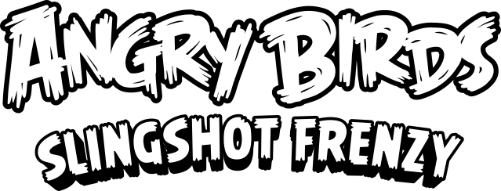

<!DOCTYPE html>
<html>
<head>
<meta charset="UTF-8">
<title>Angry Birds Slingshot Frenzy</title>
<meta name="Title" content="Angry Birds Slingshot Frenzy">
<meta name="keywords" content="angry birds, free angry birds, online game, play online, angry birds app, web browser, arcade game, online, play angry birds online, web, application, game, iphone, android, ipad, slingshot, catapult, explosions, golden egg, levels, pigs, birds, stars, high scores, angry birds rovio, play angry birds on computer, angry birds fangame, play angry birds free">
<meta name="viewport" content="width=device-width, initial-scale=1.0, maximum-scale=1.0, minimum-scale=1.0, user-scalable=no, viewport-fit=cover">
	<meta name="author" content="OssieTheOstrich">
	<link rel="manifest" href="appmanifest.json">
	<link rel="apple-touch-icon" sizes="128x128" href="icons/icon-128.png">
	<link rel="apple-touch-icon" sizes="256x256" href="icons/icon-256.png">
	<link rel="icon" type="image/png" href="icons/icon-256.png">

<link rel="stylesheet" href="style.css">

</head>
<body>
	

		<!-- 
Angry Birds Slingshot Frenzy
 -->
    <!-- 

 -->
	

	
	
	
	
	
</body>
</html>